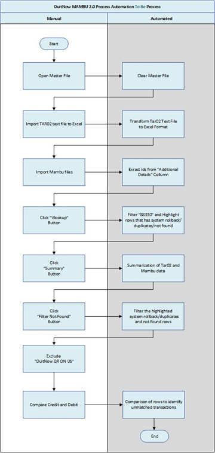
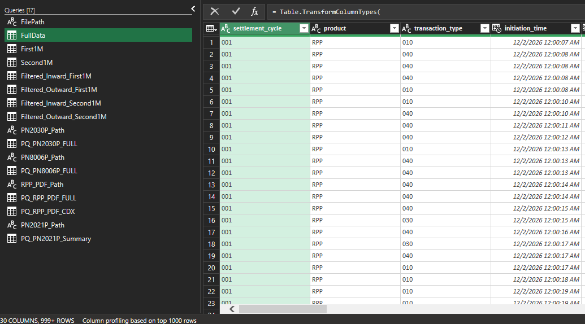
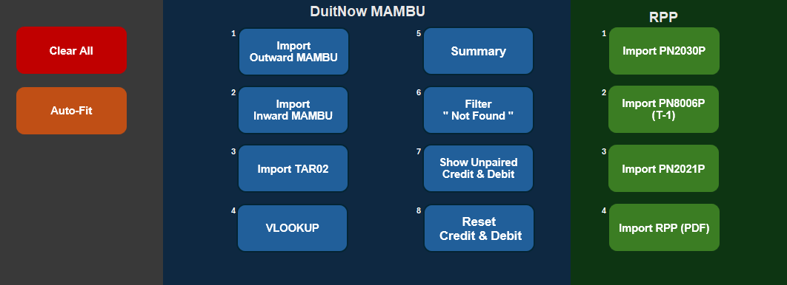

# Reconciliation-Automation-DuitNow- 🚀

## 📌 Overview
This project focuses on **automating the reconciliation process for DuitNow transactions** by transforming a manual workflow into a scalable automated solution using **Excel VBA, Power Query, and Python**.

The solution was developed after conducting **requirement gathering sessions with the General Ledger (GL) Operations team** to understand their daily reconciliation challenges when processing large transaction datasets from **PayNet TAR02 files and Mambu system reports**.

The automation handles **up to 2 million transaction records**, significantly reducing manual effort while improving reconciliation accuracy and operational efficiency.

---

## 🎯 Role & Responsibilities 

During this project, I performed responsibilities aligned with a **Business Analyst role**:

- Conducted **requirement gathering sessions** with GL Operations stakeholders
- Documented **current reconciliation workflows (As-Is process)**
- Designed **process flow diagrams using Microsoft Visio**
- Evaluated whether user requirements were feasible within existing tools
- Proposed an **automation solution using Power Query and Excel VBA**
- Coordinated **User Acceptance Testing (UAT)** with business users
- Supported **validation, testing, and business sign-off**

The goal was to ensure the solution **aligned with operational requirements while remaining scalable for high transaction volumes**.

---

## ⚠️ Problem

The GL Operations team previously reconciled **DuitNow transaction data manually** using multiple files:

- **PayNet TAR02 transaction reports (.txt files)**
- **Mambu transaction reports (Excel files)**

Key challenges included:

- ❌ Manual matching of credit and debit transactions  
- 📊 Large transaction datasets (hundreds of thousands to millions of rows)  
- ⏳ Time-consuming reconciliation process  
- ⚠️ High risk of human error  
- 📂 Multiple data sources requiring manual filtering and comparison  

This resulted in **slow reconciliation cycles and operational inefficiencies**.

---

## 💡 Solution

An **automated reconciliation tool** was developed using **Excel VBA and Power Query**, enabling large datasets to be processed and reconciled automatically.

### Key Solution Components

🔹 **Power Query**
- Handles large datasets efficiently (up to 2M records)
- Extracts TAR02 transaction data from text files
- Performs data transformation and filtering
- Refreshes datasets dynamically

🔹 **Excel VBA Automation**
- Automates file import and query refresh
- Executes transaction matching logic
- Generates reconciliation summaries
- Highlights unmatched or exception records

🔹 **Automated Reconciliation Logic**
- Cross-matching of **TAR02 and Mambu transactions**
- Identification of:
  - Matched transactions
  - Missing entries
  - Duplicate transactions
  - System rollback transactions

This automation reduced the reconciliation workload while improving transaction monitoring.

According to the process documentation, the solution **imports TAR02 and Mambu transaction files, cross-matches transactions, and generates summary outputs highlighting matched or unmatched entries**. :contentReference[oaicite:0]{index=0}

---

## 🔄 Automated Workflow

1️⃣ User opens the **Reconciliation Master File**  
2️⃣ TAR02 transaction files are imported using **Power Query**  
3️⃣ Mambu transaction files are imported automatically  
4️⃣ VBA scripts trigger **data matching using VLOOKUP logic**  
5️⃣ Transactions are automatically **highlighted if unmatched or duplicated**  
6️⃣ Summary reports are generated for reconciliation validation  
7️⃣ GL Operations team reviews exceptions before final sign-off  

---

## 📊 Business Impact

The automation significantly improved reconciliation efficiency and reduced manual workload.

| Metrics | Before Automation | After Automation | Percentage Improvement |
|------|------|------|------|
| Reconciliation Time | 40 minutes | 20 minutes | **50%** |
| Comparing Credit and Debit | 15 minutes | 5 minutes | **67%** |
| Data Import Efficiency | 10 minutes | 3 minutes | **70%** |
| Manual Steps Required | 8 steps | 2 steps | **75%** |

### 🚀 Key Outcomes

- Reduced reconciliation processing time by **50%**
- Improved data import efficiency by **70%**
- Reduced manual steps by **75%**
- Enabled processing of **large transaction datasets (up to 2M records)**
- Improved operational visibility for unmatched transactions
- Reduced risk of human reconciliation errors

---

## 🏗 System Architecture

---

## 🛠 Tools & Technologies

- 🐍 Python  
- 📊 Power Query  
- 📄 Excel VBA  
- 📈 Microsoft Excel  
- 🧩 Microsoft Visio (Process Flow Design)

---

## ✨ Key Features

- Automated import of **PayNet TAR02 transaction files**
- Automated import of **Mambu transaction reports**
- Large dataset processing using **Power Query**
- Automated reconciliation matching logic
- Highlighting of unmatched or duplicate transactions
- Automated summary generation for reconciliation validation
- Button-driven automation workflow for business users

---

## 🖼 Screenshots

### Power Query Data Processing

### Reconciliation Automation Interface

---

## 🧪 User Acceptance Testing (UAT)

The automation tool underwent **User Acceptance Testing (UAT)** with the GL Operations team to ensure the solution met business requirements.

Validation activities included:

- Testing reconciliation accuracy across multiple transaction datasets
- Validating matching logic for TAR02 and Mambu files
- Ensuring exception handling correctly identifies unmatched transactions
- Verifying performance when processing large transaction datasets

Following successful validation, the solution received **business sign-off from GL Operations**.

---

## 🔮 Future Improvements

Potential enhancements for future iterations include:

- Integration with **database storage for historical reconciliation tracking**
- Automated reconciliation dashboards using **Power BI**
- Integration with **core banking or financial systems via APIs**
- Automated alerting for reconciliation discrepancies

---

## 👨‍💻 Author

**Engku Amirul Hakeem**

Business Process Automation / Data Automation Project

Tools Used: Python, Power Query, Excel VBA
